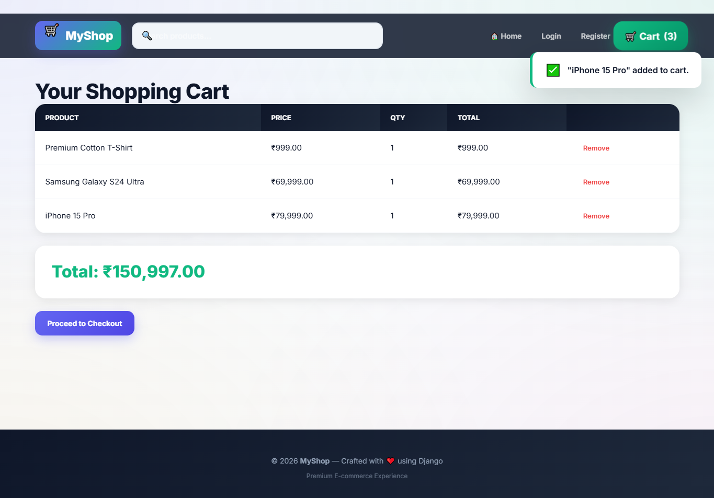
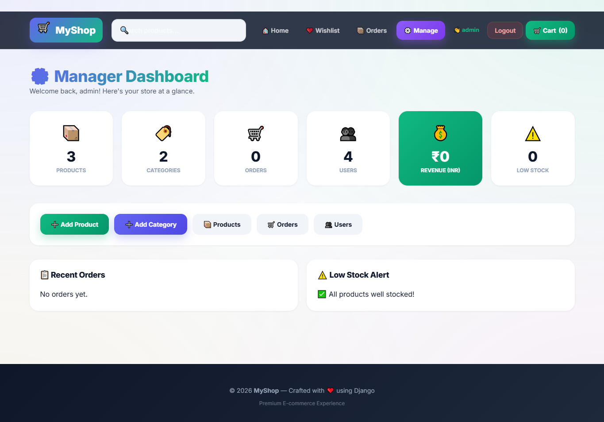
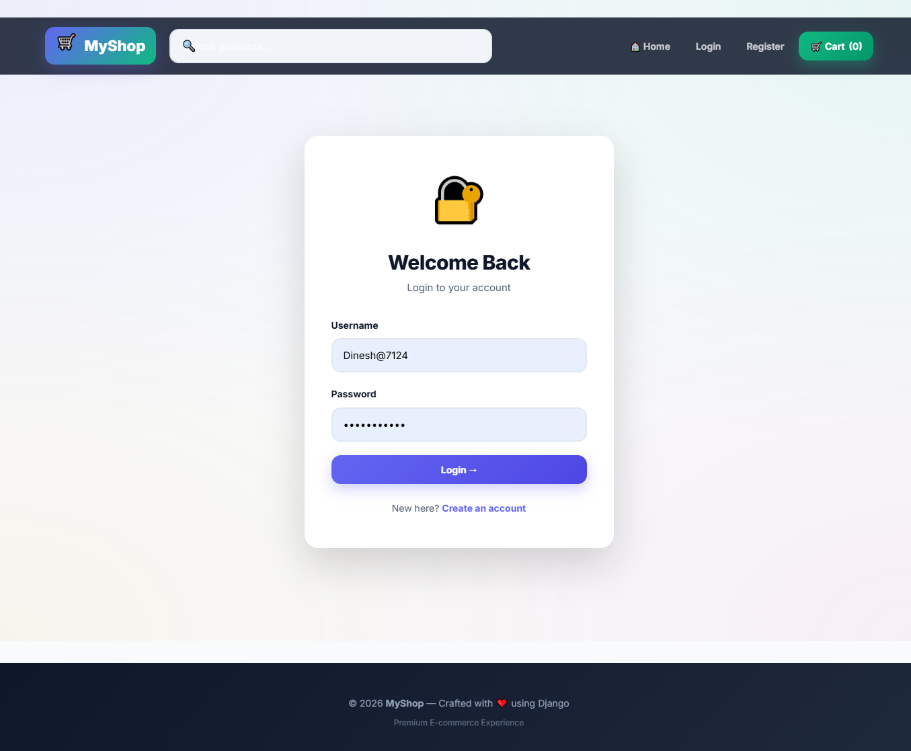

# 🛒 CodeAlpha E-commerce Store

A modern, full-featured e-commerce platform built with **Django** and **Python**. Features a premium animated UI, complete shopping cart, order management, and admin dashboard.


---

## ✨ Features

### 🛍️ Customer Features
- Product listings with images
- Category filtering
- Search functionality
- Sort by price/name/newest
- Product detail with **image slider** (multiple images per product)
- Shopping cart (session-based)
- Checkout & order processing
- Order history per user
- User registration/login/logout
- Wishlist
- Reviews & 5-star ratings
- Discount/sale prices with strikethrough
- Featured products
## 📸 Screenshots
## 📸 Screenshots

### 🏠 Homepage


### 🛍️ Product Detail


### 🛒 Shopping Cart


### ⚙️ Manager Dashboard


### 🔐 Login

### 🏠 Homepage


### 🛍️ Product Detail


### 🛒 Shopping Cart


### ⚙️ Manager Dashboard


### 🔐 Login

### ⚙️ Manager Dashboard
- Animated stats with counters (revenue in ₹)
- Product CRUD from UI
- Category CRUD from UI
- Multi-image upload per product
- Order management with status update
- User list
- Low stock alerts

### 🎨 UI/UX
- Modern gradient design
- Glass-morphism header
- Floating blob animations
- Toast notifications
- Confetti on order success
- Scroll animations
- 3D tilt on product cards
- Custom scrollbar
- Responsive mobile layout
- Indian Rupee (₹) formatting

---

## 🛠️ Tech Stack

| Component | Technology |
|-----------|-----------|
| Backend | Django 6.1.1 |
| Language | Python 3.14 |
| Database | SQLite (production-ready for small/medium sites) |
| Image Processing | Pillow |
| Frontend | HTML5, CSS3, Vanilla JS |
| Fonts | Inter (Google Fonts) |

---

## 📦 Installation

### Prerequisites
- Python 3.10+
- pip
- Git

### Steps

```bash
# 1. Clone repository
git clone https://github.com/YOUR_USERNAME/CodeAlpha_E-commerce.git
cd CodeAlpha_E-commerce

# 2. Create virtual environment
python -m venv venv

# 3. Activate virtual environment
# Windows:
venv\Scripts\activate
# Mac/Linux:
source venv/bin/activate

# 4. Install dependencies
pip install -r requirements.txt

# 5. Run migrations
python manage.py makemigrations
python manage.py migrate

# 6. Create superuser
python manage.py createsuperuser

# 7. Run development server
python manage.py runserver
